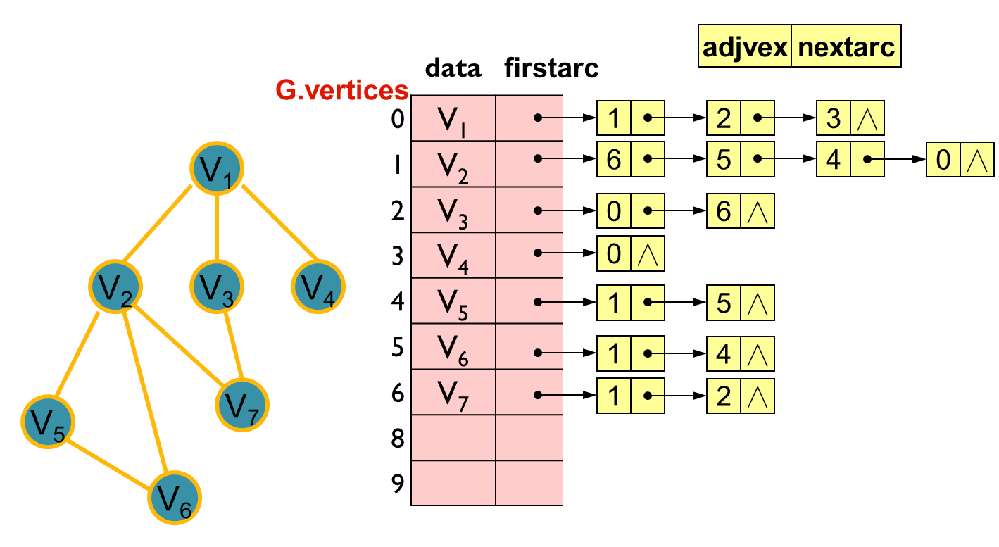
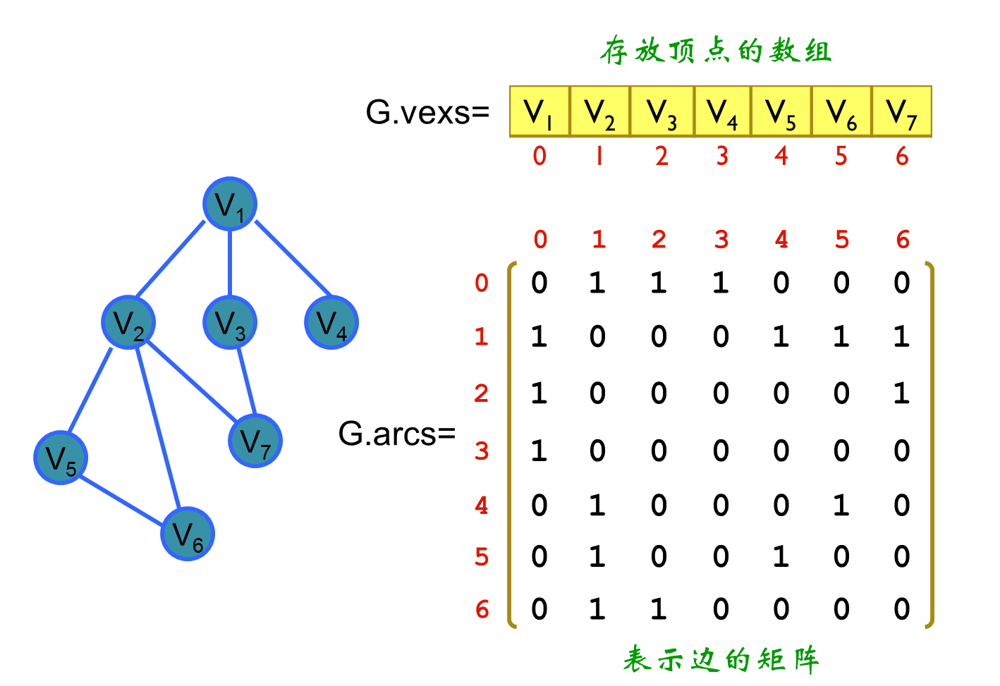

# 数据结构

+ ### 类型

  + 容器

    + map

      [链接](https://github.com/blime4/MyNote/blob/master/map%E7%9A%84%E4%BD%BF%E7%94%A8.md)

+ ### 树

  + 二叉排序树(二叉搜索树)

    [代码](https://github.com/blime4/MyNote/blob/master/code/%E4%BA%8C%E5%8F%89%E6%8E%92%E5%BA%8F%E6%A0%91.cpp)

+ ### 抽象类型

  + 集合

    + 并查集

    > `Find`
    >
    > `Union`
    + 优先队列
    
      [链接](https://github.com/blime4/MyNote/blob/master/%E4%BC%98%E5%85%88%E9%98%9F%E5%88%97.md)
  
+ ### 图

  + 邻接表

  >```c++
  >//边结点,顶点结点,邻接表
  >#define max_n 20		//最大顶点数
  >typedef struct arcNode{
  >    int adj;			//邻接点的下标
  >    acrNode *next;		//后继链指针
  >}arcNode;
  >typedef struct vNode{
  >    Vertextype data;	//顶点数据
  >    arcNode *first;		//边链头指针
  >}vNode,AdjList[max_n];
  >typedef struct{
  >     AdjList vertices;      //邻接表
  >     int vexnum,arcnum;     //顶点数和边数
  >     GraphType kind；       //图种类标志(有向无向)
  >}ALGraph;
  >```
  >
  >

  + 邻接矩阵

  > 例子1:	旅行商问题
  >
  > ```c++
  > #define max_city 20 //最大城市个数
  > #define max_path_len 999
  > typedef struct{
  >     int vex_num,arc_num;				//顶点数,边数
  >     char vexs[max_city];				//顶点向量
  >     double arcs[max_city][max_city];	//邻接矩阵
  > }Graph;
  > ```
  >
  > 

  + 最小生成树算法

    + Kruskal算法

    >1. 新建图G，G中拥有原图中相同的节点，但没有边；
    >2. 将原图中所有的边按权值从小到大排序；
    >3. 从权值最小的边开始，如果这条边连接的两个节点于图G中不在同一个连通分量中，则添加这条边到图G中；
    >4. 重复3，直至图G中所有的节点都在同一个连通分量中。

    + Prim算法
    
    > 例子:
    >
    > ```c++
    > void prim(GraphM *GM, GraphL *GL)
    > {
    >       int Aresult = 0;
    >       int n=GM->vex;
    >       //int low[n];
    >       bool visit[n];
    >       //bool ok[n];
    >       int result = GM->arcs[0][0];
    >       //low[0]=0;
    >       visit[0]=1;
    >       for(int i=1;i<n;i++){
    >             visit[i]=0;
    >       }
    >       for(int i=1;i<n;i++){
    >             edge *e = new edge;
    >             //low[i]=GM->arcs[0][i];
    >             e->a=0;e->b=i;
    >             e->weight = GM->arcs[0][i];
    >             pque.push(e);
    >       }
    >       
    >       for(int i=0;i<n;i++){
    >             edge *e;
    >             e = pque.top();
    >             result +=e->weight;
    >             visit[e->b]=1;
    >             cout << GM->vexs[e->a] << "--->" << GM->vexs[e->b] << "---"<<e->weight<<endl;
    >             Aresult +=e->weight;
    >             pque.pop();
    >             bool flag = false;
    >             for(int j=1;j<n;j++){
    >                   if(!visit[j]){
    >                         edge *ed = new edge;
    >                         ed->a=e->b;
    >                         ed->b=j;
    >                         ed->weight=GM->arcs[ed->a][ed->b];
    >                         pque.push(ed);
    >                         flag=true;
    >                         j=n;
    >                   }
    >             }
    >             if(flag==false)break;
    >       }
    >       cout<<"\n\nlowcost---"<<Aresult<<endl;
    > }
    > ```

  

+ ### 排序算法

  >[参考链接](https://blog.csdn.net/hellozhxy/article/details/79911867)
  >
  >[个人代码实现]()
  
  


